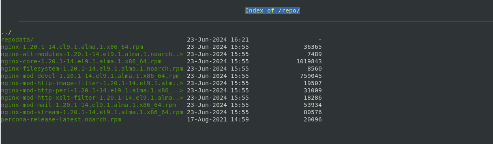

# Домашняя работа: Управление пакетами.Дистрибьюция софта

Цель работы: Изучить создание репозитория и разместить в нём свой софт

Что нужно сделать?

- Создать свой RPM пакет
- Создать свой репозиторий и разместить там ранее собранный RPM
- Реализовать это все либо в Vagrant, либо развернуть у себя через Nginx и дать ссылку на репозиторий


# Выполнение

## Создаём виртуальную машину

Создаю в домашней директории Vagrantfile, собираю стенд на основе Almalinux 9.4
 
## Создаём RPM пакет

Устанавливаем необходимые пакеты:

``` [root@repo ~]# yum install -y wget rpmdevtools rpm-build createrepo yum-utils cmake gcc git nano ```

### Собираем пакет Nginx c дополнительным модулем  ngx_brotli

Загрузим SRPM пакет Nginx для дальнейшей работы над ним:

``` 
[root@repo ~]# mkdir rpm && cd rpm
[root@repo rpm]# yumdownloader --source nginx
```

Устанавливаем зависимости для сборки пакета Nginx:
```
[root@repo rpm]# rpm -Uvh nginx*.src.rpm
[root@repo rpm]# yum-builddep nginx
```

Скачиваем исходный код модуля ngx_brotli:

```
[root@repo rpm]# cd /root
[root@repo ~]# git clone --recurse-submodules -j8 \https://github.com/google/ngx_brotli
[root@repo ~]# cd ngx_brotli/deps/brotli
[root@repo brotli]# mkdir out && cd out
```
Собираем модуль ngx_brotli:
```
[root@repo out]# cmake -DCMAKE_BUILD_TYPE=Release -DBUILD_SHARED_LIBS=OFF -DCMAKE_C_FLAGS="-Ofast -m64 -march=native 
-mtune=native -flto -funroll-loops -ffunction-sections -fdata-sections -Wl,--gc-sections" 
-DCMAKE_CXX_FLAGS="-Ofast -m64 -march=native -mtune=native -flto -funroll-loops -ffunction-sections 
-fdata-sections -Wl,--gc-sections" -DCMAKE_INSTALL_PREFIX=./installed ..

[root@repo out]# cmake --build . --config Release -j 2 --target brotlienc
[root@repo out]# cd ../../../..
```
Редактируем spec-фаил,добавим указание на модуль --add-module=/root/ngx_brotli \ :
```
[root@repo repo]# cd ~/rpmbuild/SPECS/
[root@repo SPECS]# vi nginx.spec
```
```
if ! ./configure \
    --prefix=%{_datadir}/nginx \
    --sbin-path=%{_sbindir}/nginx \
    --modules-path=%{nginx_moduledir} \
    --conf-path=%{_sysconfdir}/nginx/nginx.conf \
    --error-log-path=%{_localstatedir}/log/nginx/error.log \
    --http-log-path=%{_localstatedir}/log/nginx/access.log \
    --http-client-body-temp-path=%{_localstatedir}/lib/nginx/tmp/client_body \
    --http-proxy-temp-path=%{_localstatedir}/lib/nginx/tmp/proxy \
    --http-fastcgi-temp-path=%{_localstatedir}/lib/nginx/tmp/fastcgi \
    --http-uwsgi-temp-path=%{_localstatedir}/lib/nginx/tmp/uwsgi \
    --http-scgi-temp-path=%{_localstatedir}/lib/nginx/tmp/scgi \
    --pid-path=/run/nginx.pid \
    --lock-path=/run/lock/subsys/nginx \
    --user=%{nginx_user} \
    --group=%{nginx_user} \
    --with-compat \
    --with-debug \
    --add-module=/root/ngx_brotli \
```
Приступаем к сборке RPM пакета:

```
[root@repo SPECS]# rpmbuild -ba nginx.spec -D 'debug_package %{nil}'
```
```
+ umask 022
+ cd /root/rpmbuild/BUILD
+ cd nginx-1.20.1
+ /usr/bin/rm -rf /root/rpmbuild/BUILDROOT/nginx-1.20.1-14.el9.1.alma.1.x86_64
+ RPM_EC=0
++ jobs -p
+ exit 0
```
Проверим содержимое директории:
```
[root@repo x86_64]# ll /root/rpmbuild/RPMS/x86_64
total 1984
-rw-r--r--. 1 root root   36365 Jun 23 15:45 nginx-1.20.1-14.el9.1.alma.1.x86_64.rpm
-rw-r--r--. 1 root root 1019843 Jun 23 15:45 nginx-core-1.20.1-14.el9.1.alma.1.x86_64.rpm
-rw-r--r--. 1 root root  759045 Jun 23 15:45 nginx-mod-devel-1.20.1-14.el9.1.alma.1.x86_64.rpm
-rw-r--r--. 1 root root   19507 Jun 23 15:45 nginx-mod-http-image-filter-1.20.1-14.el9.1.alma.1.x86_64.rpm
-rw-r--r--. 1 root root   31009 Jun 23 15:45 nginx-mod-http-perl-1.20.1-14.el9.1.alma.1.x86_64.rpm
-rw-r--r--. 1 root root   18286 Jun 23 15:45 nginx-mod-http-xslt-filter-1.20.1-14.el9.1.alma.1.x86_64.rpm
-rw-r--r--. 1 root root   53934 Jun 23 15:45 nginx-mod-mail-1.20.1-14.el9.1.alma.1.x86_64.rpm
-rw-r--r--. 1 root root   80576 Jun 23 15:45 nginx-mod-stream-1.20.1-14.el9.1.alma.1.x86_64.rpm
```
Копируем содержимое в общий каталог:
```
[root@repo x86_64]# cp ~/rpmbuild/RPMS/noarch/* ~/rpmbuild/RPMS/x86_64/
[root@repo x86_64]# cd ~/rpmbuild/RPMS/x86_64
```
Устанавливаем пакет и проверим nginx:
```
[root@repo x86_64]# yum localinstall *.rpm
```
```
[root@repo x86_64]# systemctl start nginx
[root@repo x86_64]# systemctl status nginx
```
```
● nginx.service - The nginx HTTP and reverse proxy server
     Loaded: loaded (/usr/lib/systemd/system/nginx.service; disabled; preset: disabled)
     Active: active (running) since Sun 2024-06-23 15:54:21 UTC; 13s ago
    Process: 46426 ExecStartPre=/usr/bin/rm -f /run/nginx.pid (code=exited, status=0/SUCCESS)
    Process: 46427 ExecStartPre=/usr/sbin/nginx -t (code=exited, status=0/SUCCESS)
    Process: 46429 ExecStart=/usr/sbin/nginx (code=exited, status=0/SUCCESS)
   Main PID: 46430 (nginx)
      Tasks: 3 (limit: 5556)
     Memory: 6.9M
        CPU: 162ms
     CGroup: /system.slice/nginx.service
             ├─46430 "nginx: master process /usr/sbin/nginx"
             ├─46431 "nginx: worker process"
             └─46432 "nginx: worker process"
```

## Создаём свой репозиторий и размещаем в нём ранее собранный RPM

Создаём каталог repo:
```
[root@repo x86_64]# mkdir /usr/share/nginx/html/repo
```
Копируем туда собранные RPM-пакеты:
```
[root@repo x86_64]# cp ~/rpmbuild/RPMS/x86_64/*.rpm /usr/share/nginx/html/repo/
```
Инициализируем репозиторий командой:
```
[root@repo x86_64]# createrepo /usr/share/nginx/html/repo/
```
```
Directory walk started
Directory walk done - 10 packages
Temporary output repo path: /usr/share/nginx/html/repo/.repodata/
Preparing sqlite DBs
Pool started (with 5 workers)
Pool finished
```
Настроим в NGINX доступ к листингу каталога. В файле /etc/nginx/nginx.conf
в блоке server добавим следующие директивы:
index index.html index.htm;
autoindex on;
```
include /etc/nginx/conf.d/*.conf;

    server {
        listen       80;
        listen       [::]:80;
        server_name  _;
        root         /usr/share/nginx/html;

        # Load configuration files for the default server block.
        include /etc/nginx/default.d/*.conf;

        index index.html index.htm;
        autoindex on;

        error_page 404 /404.html;
        location = /404.html {
        }

        error_page 500 502 503 504 /50x.html;
        location = /50x.html {
        }
    }

```
Проверяем синтаксис и перезапускаем NGINX:
```
[root@repo x86_64]# nginx -t
nginx: the configuration file /etc/nginx/nginx.conf syntax is ok
nginx: configuration file /etc/nginx/nginx.conf test is successful
[root@repo x86_64]# nginx -s reload
```
Посмотрим на репозиторий с помощью Lynx:
 


Протестируем репозиторий, добавим его в /etc/yum.repos.d:
```
[root@repo x86_64]# cat >> /etc/yum.repos.d/otus.repo << EOF
> [otus]                                  
name=otus-linux
baseurl=http://localhost/repo
gpgcheck=0
enabled=1
EOF
```
Проверим его содержимое:
```
[root@repo x86_64]# yum repolist enabled | grep otus

otus                             otus-linux
```
Добавим пакет в репозиторий:
```
[root@repo x86_64]# cd /usr/share/nginx/html/repo/
[root@repo repo]# wget https://repo.percona.com/yum/percona-release-latest.noarch.rpm
```
Обновим список пакетов в репозитории:
```
[root@repo repo]# createrepo /usr/share/nginx/html/repo/
```
```
Directory walk started
Directory walk done - 11 packages
Temporary output repo path: /usr/share/nginx/html/repo/.repodata/
Preparing sqlite DBs
Pool started (with 5 workers)
Pool finished
```
```
[root@repo repo]# yum makecache
AlmaLinux 9 - AppStream                                                                                               5.4 kB/s | 4.2 kB     00:00    
AlmaLinux 9 - BaseOS                                                                                                  5.7 kB/s | 3.8 kB     00:00    
AlmaLinux 9 - Extras                                                                                                  4.9 kB/s | 3.3 kB     00:00    
otus-linux                                                                                                            114 kB/s | 7.2 kB     00:00    
Metadata cache created.
[root@repo repo]# yum list | grep otus
percona-release.noarch                               1.0-27                              otus
```
Установим репозиторий percona-release:
```
[root@repo repo]# yum install -y percona-release.noarch
```
## Реализовать это все либо в Vagrant, либо развернуть у себя через Nginx и дать ссылку на репозиторий

Реализация представлена в блоке provision vagrant-файла.


